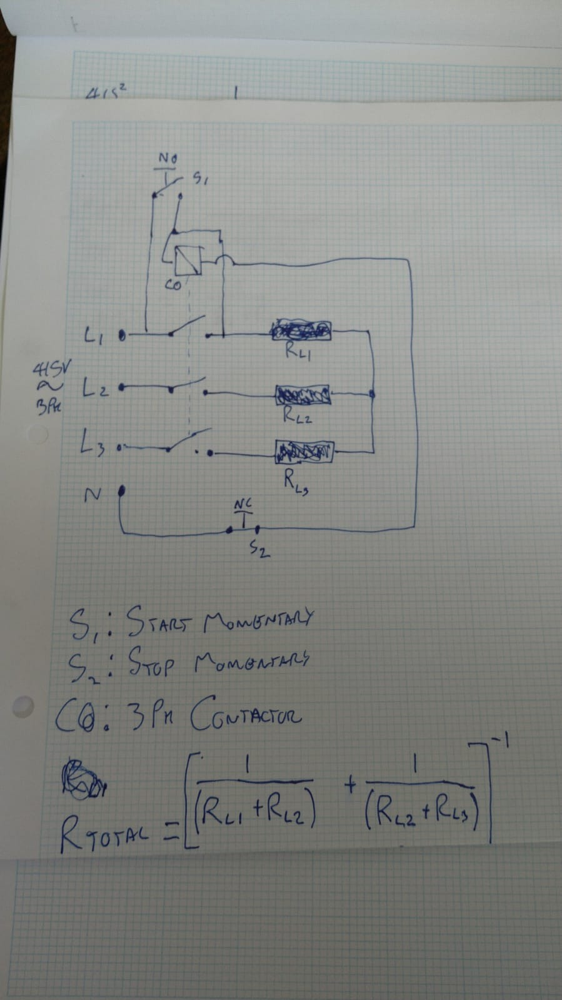
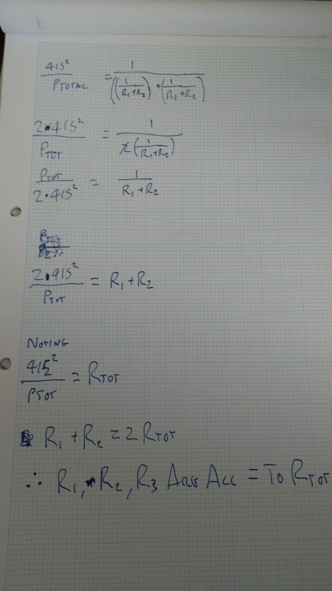
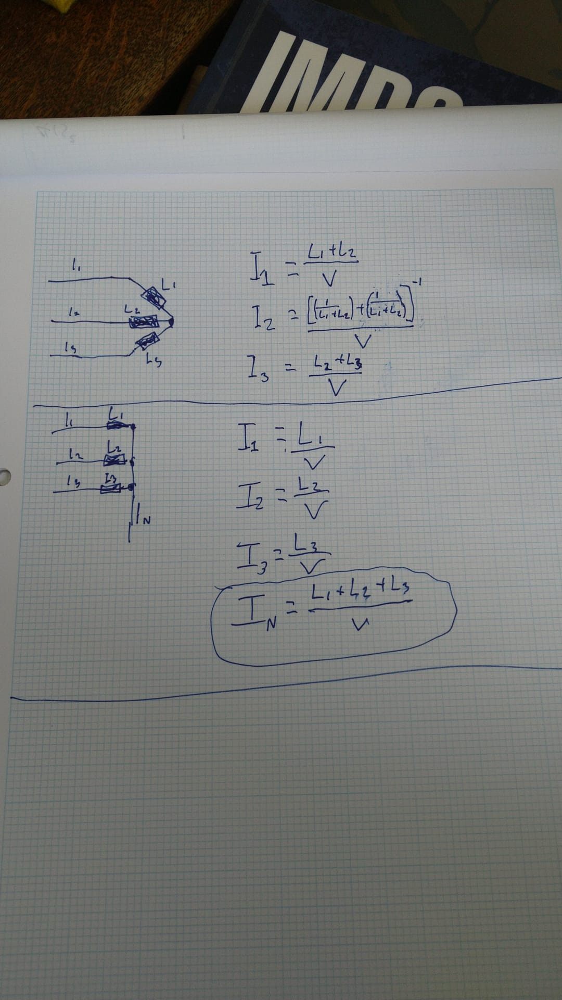

# Open source kiln 

This project has grown out of the design (and hopefully construction in the near
future) of a kiln for heat-treating 80CrV2 steel.

The project is divided into two main parts: the driver circuit, and the kiln
itself. The driver circuit is assembled from readily-available modules arranged
on a custom PCB (we have a few spares and are happy to post you one of them),
whose design files and production-ready gerbers are in the repository.
The 

All designs are open: copying and improving is not only allowed, but encouraged.

## Driver circuit

### PCB

We chose to use readily available modules both for protoyping purposes, and also
so reproduction is easy: the modules can all be purchased cheaply and the whole
assembly requires only through-hole soldering skills.

The components used are:

* Wemos D1 mini ESP8266 --- logic and power for board
* MAX6675 temperature module --- converts voltage from K-type thermocouple into signal which can be processed by ESP8266
* Rotary encoder --- input with rotating left and right, and depressing
* 0.96" TFT display
* 3x 5V relay modules

Some of these modules may come with headers already soldered, in which case you
may have to desolder and re-solder appropriate headers (all headers on PCB are
2.54mm/0.1" headers).

The PCB was designed with Kicad.

The logic of the design is that the temperature module measures the temperature
inside the kiln, and then according to the settings (TFT + rotary encoder
interface) the relays are activated to regulate the kiln temperature.

### Software

## Physical kiln

### Materials
We will need 27 vermiculite bricks for the main oven. 

### Firebrick enclosure
This is to be made from vermiculite firebricks. These are supplied in Imperial measurements; each brick has dimension:
$$ 8 \times 1 \times 4 ''.$$
The firebrick enclosure is to consist of two parts: the oven cavity, and a door. The measurements of these are as follows:

**Oven**:
Interior: $16 \times 8 \times 6''$

Exterior: $10 \times 17 \times 8$

**Door**:
The door is to be two bricks thick. The dimensions are:
$2 \times 10 \times 8$.

### Plaster casing
The plan is to cast a set of thick sheets with which to encase the oven. Since the door will be two bricks thick, there will be no outer casing for the door. The dimensions for these are to be:

Walls($\times 2$): $17 \times 10 \times d$

floor / ceiling ($\times 2$): $(17+d)\times(8+2d)\times d$

back ($\times 1$): $(8 + 2d)\times 10\times d$

where $d$ gives the thickness for the sheets. Provisionally, this is set at $1.5$''. 

### Approach 1:
Mix vermiculite to quick-set cement in a ratio $4:1$, add water until you can squeeze a fist and get a few drops out. 

### Metal case

### Resistive Elements
We use A1 kanthal wire, sourced from [here](https://www.ebay.co.uk/itm/322024532921). This has a resistivity of $1.8\Omega / m$. Aiming for $R = 13.2 \Omega$ per coil, we calculate:
$$d = 13.2 / 1.8 \\ = 7.3 $$
So that each element ought to be 7.3 $m$ long. 

### Wiring diagram
These images temporary, to be replaced

### Safety considerations
We are to use:
- MCBs on each resistor element to isolate those in case of a short circuit. Also if one of the other coils fails, the power draw on the remaining coils would increase - the MCB here would save those coils before they burn out.
- Magnetic switch; this will leave a circuit *open* when the oven door is open, and *closed* when the oven door is closed. This means that there should be no power to the heating elements when the door is open. 
- Connector: This would function as a relay switch for the three phase power
- Relay: This would act as a pre-relay, and would be controlled directly by the PCB. (Expand this section)

