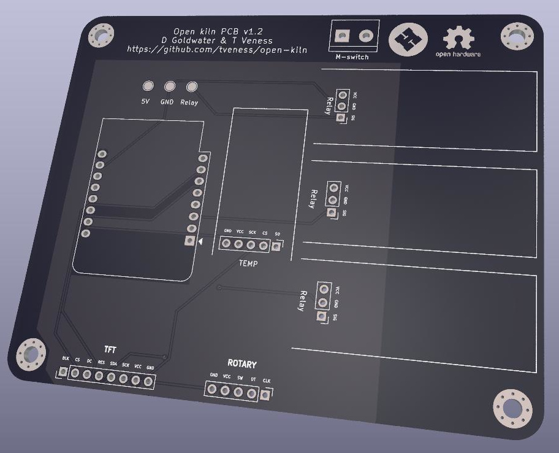

# Open source kiln 

This project has grown out of the design (and hopefully construction in the near
future) of a kiln for heat-treating 80CrV2 steel.

The project is divided into two main parts: the driver circuit, and the kiln
itself. The driver circuit is assembled from readily-available modules arranged
on a custom PCB (we have a few spares and are happy to post you one of them),
whose design files and production-ready gerbers are in the repository.
The 

All designs are open: copying and improving is not only allowed, but encouraged.

## Driver circuit

### PCB

We chose to use readily available modules both for protoyping purposes, and also
so reproduction is easy: the modules can all be purchased cheaply and the whole
assembly requires only through-hole soldering skills.

The components used are:

* Wemos D1 mini ESP8266 --- logic and power for board
* MAX6675 temperature module --- converts voltage from K-type thermocouple into signal which can be processed by ESP8266
* Rotary encoder --- input with rotating left and right, and depressing
* 0.96" TFT display
* 3x 5V relay modules

Some of these modules may come with headers already soldered, in which case you
may have to desolder and re-solder appropriate headers (all headers on PCB are
2.54mm/0.1" headers).

The PCB was designed with Kicad.

The logic of the design is that the temperature module measures the temperature
inside the kiln, and then according to the settings (TFT + rotary encoder
interface) the relays are activated to regulate the kiln temperature.

### Software

## Physical kiln

### Materials

### Firebrick enclosure

### Plaster casing

### Metal case

### Power

### Safety considerations
